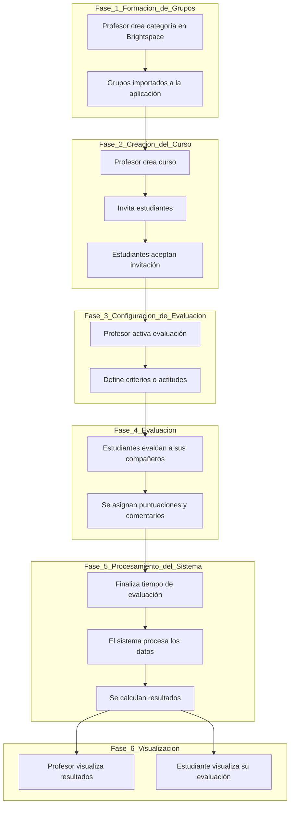

# Sistema de Evaluación entre Compañeros

## 1. Referentes

- **iSpring Learn:** [https://www.ispring.es/blog/herramientas-evaluacion-desempeno](https://www.ispring.es/blog/herramientas-evaluacion-desempeno)
- **Primalogik:** [https://www.ispring.es/blog/herramientas-evaluacion-desempeno](https://www.ispring.es/blog/herramientas-evaluacion-desempeno)
- **Factorial:** [https://factorial.es/blog/mejores-programas-evaluacion-desempeno/](https://factorial.es/blog/mejores-programas-evaluacion-desempeno/)

> **Nota personal:** La aplicación de factorial es la más completa

---

## 2. Composición y diseño de la solución

Propongo una arquitectura basada en un **Monolito Modular**. Será una aplicación móvil desarrollada en **Flutter** que gestionará los roles: profesor y estudiante. El backend estará organizado internamente en módulos funcionales.

La interfaz en Flutter cambiará según el rol del usuario y también permite crear cursos, unirse, evaluar compañeros. El backend nos permitirá controlar la autentificación y los permisos, administrar los cursos, las evaluaciones e integrar con Brightspace, es decir, los diferentes módulos funcionales en los que se dividirían las responsabilidades y los requerimientos de nuestra aplicación. Y tendrá una base de datos relacional debido a que la aplicación maneja relaciones entre las entidades: Usuario, cursos, categorías, etc.

También habrá un apartado donde los profesores y los estudiantes podrán visualizar la evaluación hecha por sus compañeros no solo con datos si no con gráficos (por ejemplo, una evaluación 360 o un gráfico de barras) según actitudes específicas que se están evaluando en la categoría.

### Archivos del sistema

```text
Flutter App
     ↓
Backend (Modular Monolith)
     ├── Auth
     ├── Users
     ├── Courses
     ├── Groups
     ├── Assessments
     ├── Invitations
     └── Integration
     ↓
Database 
```
---

## 3. Flujo Funcional



### 3.1 Formación de los grupos

- El profesor crea la categoría (Proyecto Final, Taller de Node.js, etc) en la cuál se organizaran los equipos en Brightspace.
- Esos grupos con sus respectiva categoría se importan a la aplicación.
- Cada categoría permite varios grupos.

---

### 3.2 Creación del curso en la aplicación

- El profesor crea el curso dentro de la aplicación.
- Invita a los estudiantes con invitaciones privadas o un método de verificación.
- Los estudiantes pueden ver los cursos a los que han sido invitados y aceptar la invitación con lo cuál quedan inscritos en el curso.

---

### 3.3 Activación de la evaluación

- El profesor escoge una categoría (trabajo) específica del curso.
- Activa la evaluación para la categoría.
- El profesor define los criterios o actitudes a evaluar (responsabilidad, comunicación, puntualidad, etc.).
- La evaluación es habilitada para todos los estudiantes que pertenezcan a los grupos de dicha categoría.

---

### 3.4 Evaluación entre compañeros

- Cada estudiante ingresa a la evaluación habilitada por el profesor.
- Solo visualiza a los mientros de su equipo (grupo).
- Evalua a cada uno de sus compañeros según los criterios o actitudes específicas.
- La evaluación se hace asignando una puntación (por ejemplo, del 0 al 10) y puede dejar comentarios.

---

### 3.5 Tiempo de evaluación y resultados

- La evaluación tendrá un límite de tiempo.
- Una vez finalizado ese tiempo, el sistema procesa los datos.
- Se calculan los resultados y se organizan para su visualización.

---

### 3.6 Visualización de los datos

#### El profesor

- Puedes ver los resultados individuales y grupales.
- Puede analizar los resultados según los criteros a evaluar.

#### El estudiante

- Ve la evaluación hecha por sus compañeros sobre su desempeño.
- Puede ver los resultados por medio de gráficos según los criterios.

---

## 4. Enlace al Prototipo en Figma

**Prototipo:** [https://www.figma.com/make/NQAdWI6zH4U7Tni09IJSNB/Evaluaci%C3%B3n-de-compa%C3%B1eros-en-curso?t=MgdpU7uGHwHfF4Jn-20&fullscreen=1](https://www.figma.com/make/NQAdWI6zH4U7Tni09IJSNB/Evaluaci%C3%B3n-de-compa%C3%B1eros-en-curso?t=MgdpU7uGHwHfF4Jn-20&fullscreen=1)

