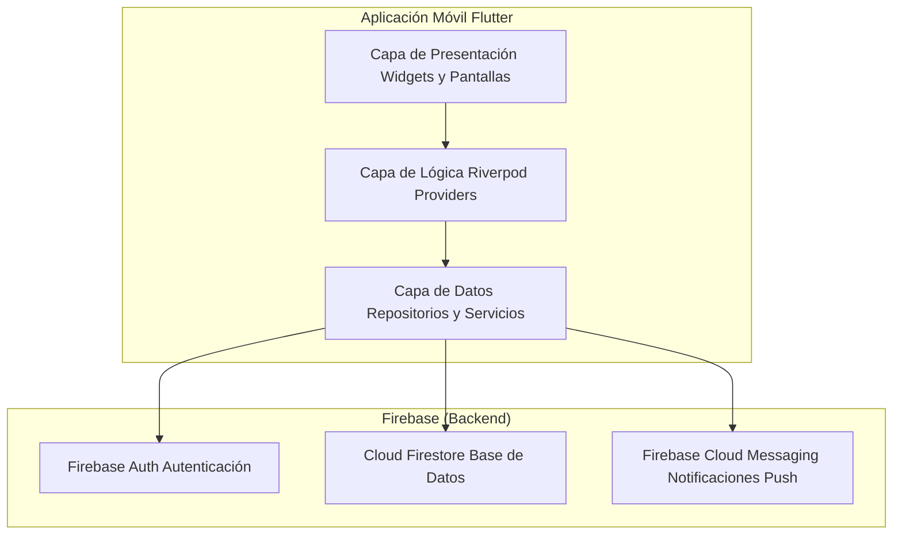
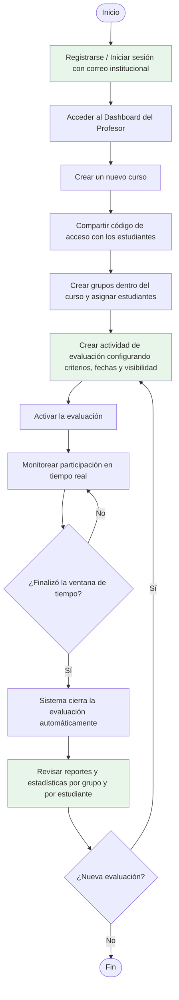
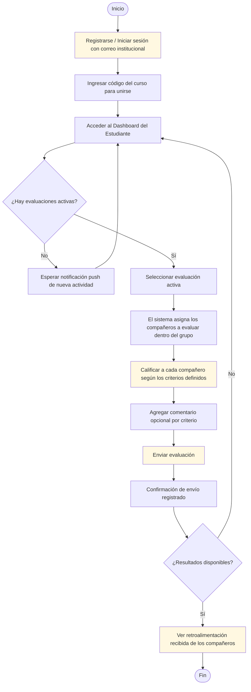

# Sistema de Evaluación entre Pares para Trabajo Colaborativo

> **Propuesta individual de aplicación móvil para la coevaluación estructurada en contextos universitarios**

---

## Tabla de Contenidos

1. [Referentes](#1-referentes)
2. [Composición y Diseño de la Solución](#2-composición-y-diseño-de-la-solución)
3. [Flujo Funcional](#3-flujo-funcional)
4. [Justificación de la Propuesta](#4-justificación-de-la-propuesta)
5. [Prototipo y Diseño Visual](#5-prototipo-y-diseño-visual)

---

## 1. Referentes

### Referente 1: CATME Team-Maker

Plataforma web desarrollada por la Universidad de Purdue orientada a la formación de equipos de trabajo y la evaluación entre pares. Permite al docente crear encuestas de autoevaluación y coevaluación, y genera reportes individuales y grupales sobre el desempeño de los estudiantes dentro de los equipos.

**Fortalezas:**
- Sistema probado académicamente con respaldo institucional
- Formularios de evaluación basados en evidencia pedagógica
- Generación automática de reportes por estudiante y por grupo
- Soporte para evaluación anónima y no anónima

**Limitaciones:**
- Interfaz web, sin aplicación móvil nativa
- Curva de configuración elevada para docentes sin experiencia técnica
- Acceso condicionado a suscripción institucional
- No permite integración con LMS locales de manera directa

**Enlace:** [https://www.catme.org](https://www.catme.org)

---

### Referente 2: SpeedGrader (Canvas LMS)

Herramienta de calificación integrada dentro del LMS Canvas que permite, entre otras funciones, configurar actividades de evaluación entre pares con rúbricas. Los estudiantes pueden calificar trabajos de sus compañeros y dejar retroalimentación escrita. Canvas ofrece versión móvil a través de su aplicación oficial.

**Fortalezas:**
- Integrado directamente en el flujo de trabajo del LMS
- Aplicación móvil disponible para iOS y Android
- Soporte nativo para rúbricas y evaluación por criterios
- Gestión centralizada de cursos y grupos

**Limitaciones:**
- La evaluación entre pares es una función secundaria, no el enfoque principal
- Depende completamente del ecosistema Canvas
- Flexibilidad limitada para configurar criterios personalizados de desempeño en equipo
- No diferencia claramente entre evaluación de entregables y evaluación de comportamiento colaborativo

**Enlace:** [https://www.instructure.com/canvas](https://www.instructure.com/canvas)

---

### Referente 3: iPeer (University of British Columbia)

Aplicación web de código abierto desarrollada por la UBC para facilitar la evaluación entre pares en cursos universitarios con trabajo grupal. Permite al docente crear actividades de evaluación, asignar compañeros evaluadores y visualizar resultados agregados. Los estudiantes completan formularios de evaluación basados en criterios definidos por el docente.

**Fortalezas:**
- Código abierto y desplegable en servidores institucionales
- Diseñado específicamente para evaluación entre pares en educación superior
- Soporta múltiples tipos de preguntas y criterios de evaluación
- Permite gestión de grupos dentro de la propia plataforma

**Limitaciones:**
- Interfaz web desactualizada, sin soporte móvil
- Requiere infraestructura técnica para instalación y mantenimiento
- Sin notificaciones activas para recordar evaluaciones pendientes
- Experiencia de usuario poco intuitiva para estudiantes no técnicos

**Enlace:** [https://ipeer.ctlt.ubc.ca](https://ipeer.ctlt.ubc.ca)

---

## 2. Composición y Diseño de la Solución

### Visión General

Se propone una **aplicación móvil única** desarrollada en **Flutter**, orientada exclusivamente a la evaluación entre pares en trabajos colaborativos universitarios. La aplicación diferencia los roles de **Profesor** y **Estudiante** de forma interna tras la autenticación, y opera sobre un backend basado en **Firebase**, eliminando la necesidad de infraestructura propia de servidor.

La solución es **autónoma**: no depende de ningún LMS externo para su funcionamiento básico. Los grupos se crean y gestionan directamente dentro de la aplicación por parte del docente, simplificando el proceso de adopción y configuración.

---

### Arquitectura Propuesta

La arquitectura sigue un modelo de **tres capas** con separación clara de responsabilidades:



**Decisiones de diseño:**

- **Flutter** como framework de desarrollo para garantizar una sola base de código multiplataforma (Android e iOS).
- **Firebase Auth** para autenticación con correo institucional, sin necesidad de implementar un sistema propio de gestión de usuarios.
- **Cloud Firestore** como base de datos en tiempo real, permitiendo que el estado de las evaluaciones se actualice automáticamente en todos los dispositivos sin necesidad de refrescar manualmente.
- **Firebase Cloud Messaging (FCM)** para el envío de notificaciones push cuando se abra una nueva evaluación o cuando esté próxima a cerrar.
- **Riverpod** como gestor de estado, por su enfoque declarativo, testabilidad y ausencia de dependencia del árbol de widgets.

---

### Módulos de la Aplicación

La aplicación se organiza en los siguientes módulos funcionales:

**Módulo de Autenticación**
Registro e inicio de sesión mediante correo electrónico institucional. Verificación del dominio del correo para garantizar que solo usuarios de la institución puedan acceder.

**Módulo de Cursos y Grupos**
El profesor crea cursos y define los equipos de trabajo manualmente desde la aplicación. Los estudiantes se unen a un curso mediante un **código de acceso único de seis dígitos** generado automáticamente.

**Módulo de Rúbricas**
El profesor configura los criterios de evaluación para cada actividad (por ejemplo: puntualidad, comunicación, contribución, actitud). Cada criterio tiene una escala numérica del 1 al 5 y una descripción de referencia por nivel.

**Módulo de Evaluaciones**
Gestión completa del ciclo de evaluación: apertura, evaluación por parte de los estudiantes, cierre automático por vencimiento de la ventana de tiempo y visualización de resultados.

**Módulo de Reportes**
Visualización de resultados por actividad, por grupo y por estudiante. Los estudiantes solo ven sus propios resultados si el profesor lo permite.

---

### Modelo de Datos

```
Usuario
  ├── id
  ├── nombre
  ├── correo
  └── rol (profesor | estudiante)

Curso
  ├── id
  ├── nombre
  ├── codigoAcceso
  └── profesorId

Grupo
  ├── id
  ├── cursoId
  ├── nombre
  └── miembros: [estudianteId]

Actividad
  ├── id
  ├── cursoId
  ├── titulo
  ├── fechaInicio
  ├── fechaCierre
  ├── resultadosPublicos (boolean)
  └── criterios: [Criterio]

Criterio
  ├── id
  ├── nombre
  └── descripcion

Evaluacion
  ├── id
  ├── actividadId
  ├── evaluadorId
  ├── evaluadoId
  └── puntajes: [{ criterioId, valor }]
```

---

## 3. Flujo Funcional

### Flujo del Profesor



### Flujo del Estudiante



### Descripción del Flujo

**Flujo del Profesor:**
El profesor crea el curso, comparte el código de acceso con los estudiantes y conforma los grupos. Cuando el equipo está listo para una evaluación, configura los criterios de la rúbrica, establece la ventana de tiempo y activa la evaluación. Durante el período activo puede monitorear cuántos estudiantes han respondido. Al cierre automático, accede a reportes por grupo e individuo para tomar decisiones formativas o de calificación.

**Flujo del Estudiante:**
El estudiante se une al curso con el código proporcionado por el profesor. Cuando hay una evaluación activa, recibe una notificación push y accede al formulario desde la aplicación. El sistema le presenta a cada compañero de su grupo (sin incluirse a sí mismo) y le solicita calificar cada criterio con un valor numérico y, opcionalmente, un comentario. Al enviar, la evaluación queda registrada. Si el profesor configuró los resultados como públicos, el estudiante puede ver la retroalimentación recibida una vez cerrada la actividad.

---

## 4. Justificación de la Propuesta

### Hallazgos de Entrevistas con Docentes

Se realizaron entrevistas informales con tres profesores de cursos con metodología de trabajo en grupo. Los hallazgos más relevantes fueron:

- Los docentes señalaron que **la evaluación del producto final no refleja el esfuerzo individual** de cada integrante y que con frecuencia algunos estudiantes aportan significativamente más que otros sin que eso se vea reflejado en la nota grupal.
- Manifestaron interés en herramientas que **no requieran configuración técnica compleja** y que puedan usarse sin depender de que la institución adopte una plataforma determinada.
- Indicaron que **las notificaciones son clave**: cuando las evaluaciones se asignan por correo o simplemente quedan en una plataforma web, los estudiantes frecuentemente no las completan a tiempo.
- Expresaron preferencia por una herramienta que les permita **ver el progreso de respuestas en tiempo real**, sin tener que esperar al cierre de la evaluación para saber si los estudiantes están participando.

### Análisis Comparativo

| Aspecto | CATME | SpeedGrader | iPeer | **Esta propuesta** |
|---|---|---|---|---|
| **Tipo de acceso** | Web | Web + App (Canvas) | Web | **App móvil nativa** |
| **Backend propio requerido** | No | No (Canvas) | Sí | **No (Firebase)** |
| **Notificaciones push** | No | Parcial | No | **Sí** |
| **Independencia del LMS** | Parcial | No | Sí | **Sí** |
| **Creación de grupos en la app** | Sí | No | Sí | **Sí** |
| **Complejidad de configuración** | Alta | Media | Alta | **Baja** |
| **Código abierto** | No | No | Sí | **Sí (académico)** |
| **Infraestructura requerida** | Suscripción | Incluido en Canvas | Servidor propio | **Firebase gratuito (escala pequeña)** |

### Por qué esta arquitectura

La elección de Firebase como backend responde a una necesidad práctica: **reducir la fricción técnica de despliegue**. No requiere configurar ni mantener un servidor propio, lo que hace que la aplicación pueda ponerse en marcha con mínimos recursos técnicos y sea viable en un contexto académico con tiempos de desarrollo acotados.

El uso de **códigos de acceso numéricos** en lugar de integraciones con LMS responde al feedback de los docentes, que valoran la simplicidad por encima de la automatización. Un flujo de incorporación de seis dígitos es comprensible para cualquier estudiante sin importar su nivel de alfabetización digital.

La **actualización en tiempo real** mediante Firestore cubre directamente la necesidad expresada por los docentes de monitorear la participación sin esperar al cierre de la evaluación.

---

## 5. Prototipo y Diseño Visual

### Enlace al Prototipo en Figma

**[Ver prototipo interactivo en Figma](#)**
https://www.figma.com/make/bl6ne8sjw4wwb0OdmKjKX3/Peer-Evaluation-App-UI?t=3d9tg0xdi9C8ukc1-1

---

## Conclusiones

Esta propuesta prioriza **accesibilidad, simplicidad y viabilidad técnica** sobre la integración con sistemas institucionales. Las decisiones de diseño responden directamente a los problemas identificados en las entrevistas con docentes y a las limitaciones observadas en los referentes analizados. La combinación de Flutter, Firebase y un flujo de incorporación por código numérico permite construir una solución funcional, desplegable y mantenible dentro del alcance de un proyecto universitario.
