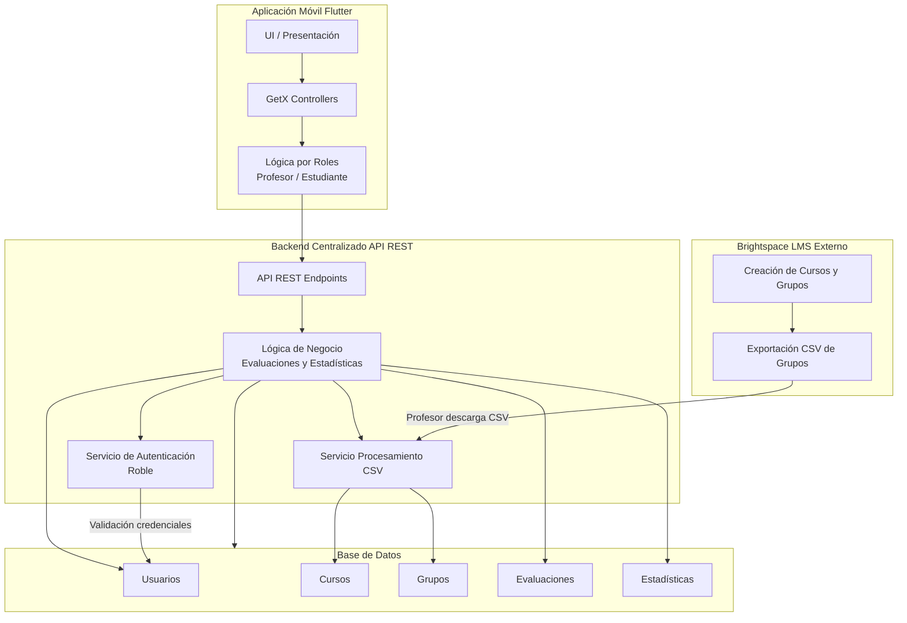
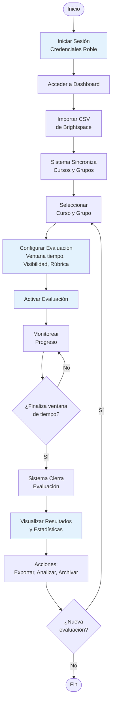
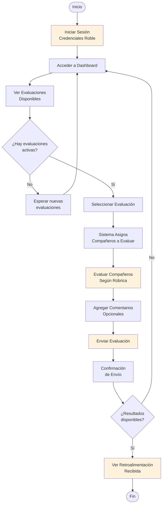
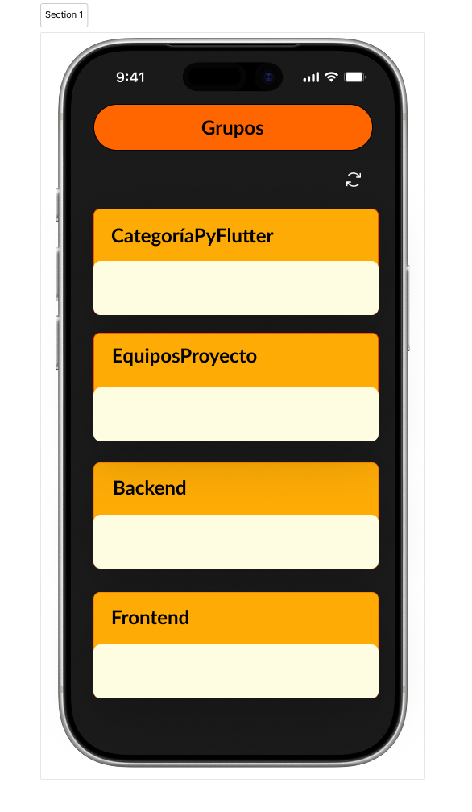
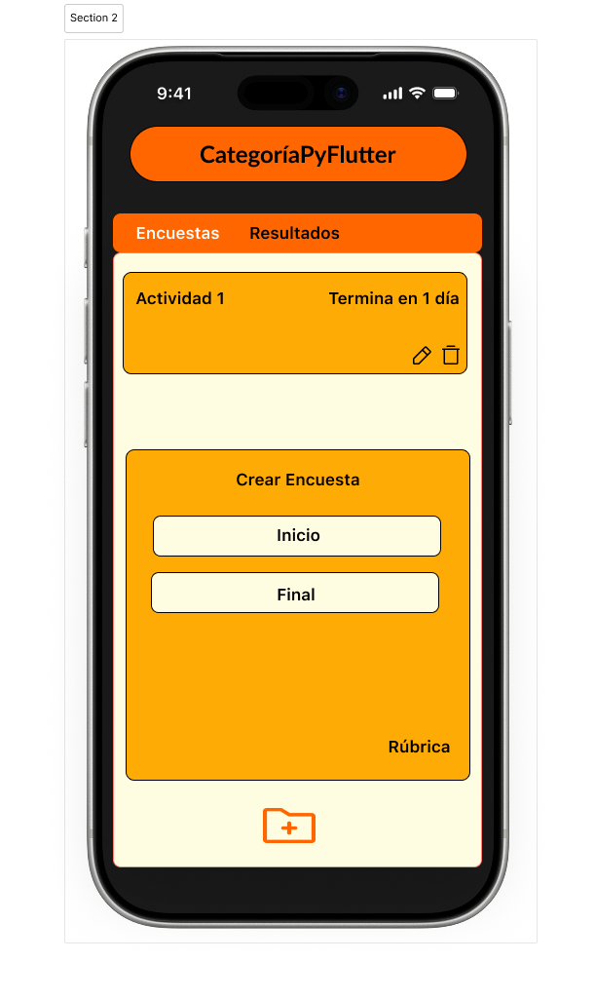
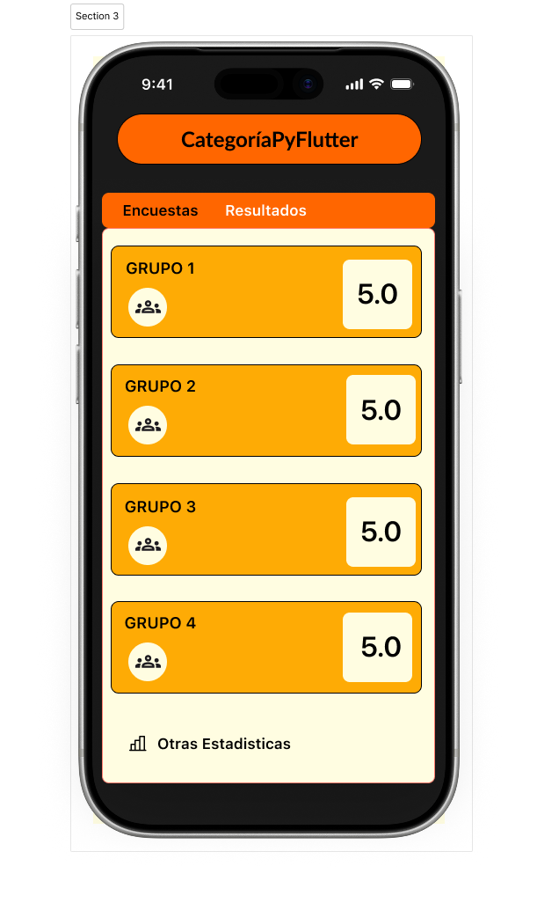
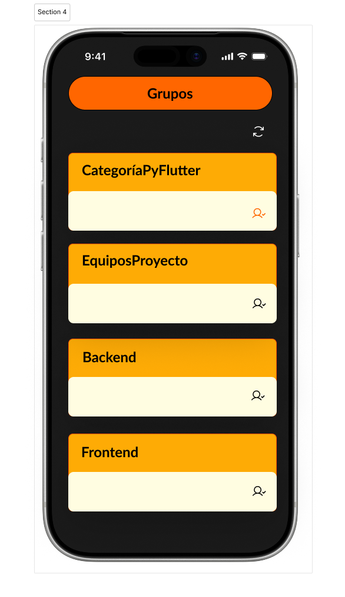
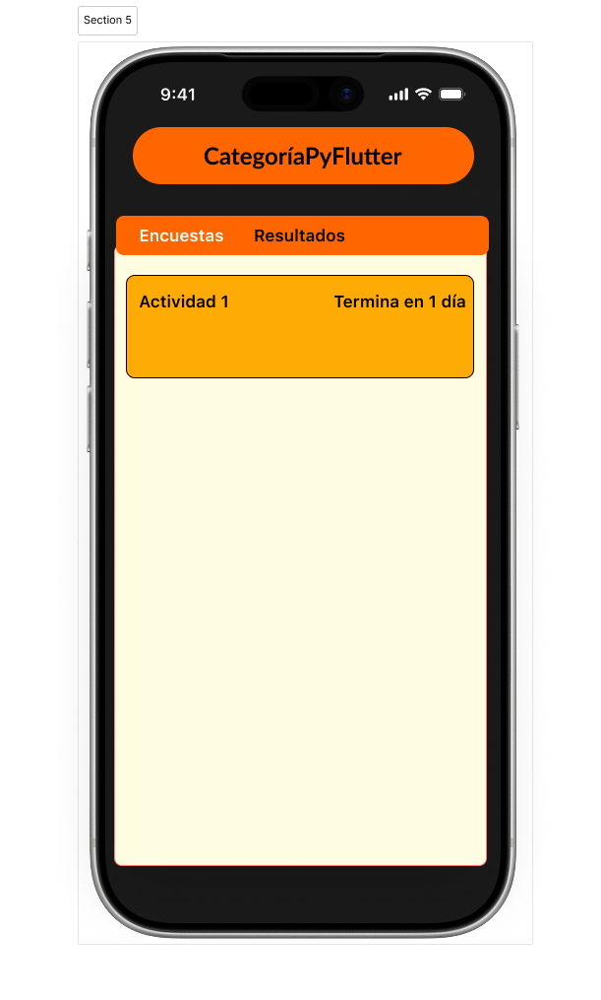
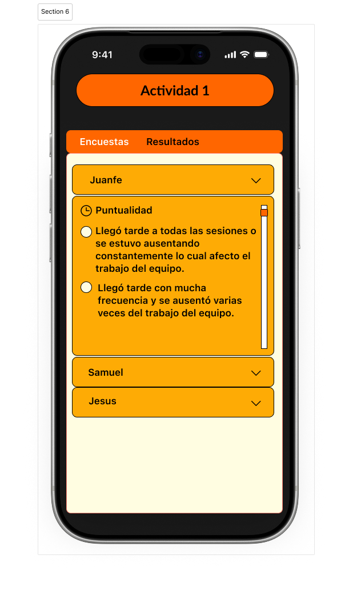

# Sistema de Coevaluación Móvil para Trabajo Colaborativo

> **Solución móvil institucional para la evaluación entre pares en contextos de aprendizaje colaborativo**

---

## Tabla de Contenidos

1. [Referentes](#referentes)
2. [Composición y Diseño de la Solución](#composición-y-diseño-de-la-solución)
3. [Flujo Funcional](#flujo-funcional)
4. [Justificación de la Propuesta](#justificación-de-la-propuesta)
5. [Prototipo y Diseño Visual](#prototipo-y-diseño-visual)

---

## Referentes

### Referente 1: CoRubrics

Extensión para Google Workspace que automatiza procesos de evaluación mediante rúbricas. Funciona integrada con Google Sheets, Forms y Classroom para facilitar la coevaluación entre estudiantes.

**Fortalezas:**
- Automatización del cálculo de resultados
- Integración con herramientas ampliamente utilizadas
- Evaluación estructurada por criterios

**Limitaciones:**
- Requiere múltiples pasos y herramientas
- No es una aplicación unificada
- Sin dashboard analítico centralizado
- Dependencia total del ecosistema Google

**Enlaces:** [Google Workspace Marketplace](https://workspace.google.com/marketplace/app/corubrics/969519855495?hl=es) | [Documentación](https://corubrics-es.tecnocentres.org/)

---

### Referente 2: Peergrade (Actualmente cerrado sin soporte)

Plataforma web especializada en evaluación entre pares para educación secundaria y superior. Ofrece flujo completo de coevaluación con creación de actividades, diseño de rúbricas, asignación automática de evaluadores y estadísticas consolidadas.

**Fortalezas:**
- Plataforma especializada con flujo integrado
- Asignación automática de evaluadores
- Control de anonimato y analítica detallada

**Limitaciones:**
- No es una app móvil nativa
- Requiere suscripción institucional
- Sin soporte ni actualizaciones actualmente

**Enlaces:** [WebCatalog](https://webcatalog.io/es/apps/peergrade)

---

### Referente 3: FeedbackFruits

Plataforma profesional de retroalimentación y evaluación colaborativa para educación superior. Se enfoca en peer assessment, autoevaluación y retroalimentación formativa mediante rúbricas. Ofrece importación automática de grupos y analítica avanzada.

**Fortalezas:**
- Plataforma profesional con analítica avanzada
- Integración directa con LMS
- Control de visibilidad y anonimato

**Limitaciones:**
- Dependencia total del LMS
- No es aplicación móvil independiente
- Requiere licencia institucional

**Enlaces:** [FeedbackFruits](https://feedbackfruits.com/)

---

## Composición y Diseño de la Solución

### Arquitectura Propuesta

Se propone una **arquitectura modular integrada** compuesta por:

- Una sola aplicación móvil institucional desarrollada en **Flutter**
- Diferenciación interna por roles (Profesor / Estudiante)
- Módulo interno de Coevaluación y Estadísticas
- Backend centralizado con API REST
- Servicio de importación y procesamiento de archivos CSV exportados desde Brightspace
- Base de datos centralizada para almacenamiento de evaluaciones y métricas
- Autenticación institucional gestionada mediante **Roble**

---

### Aplicación Móvil Única

La solución contempla una única aplicación móvil institucional que integra ambos roles del sistema:
- **Rol Profesor**
- **Rol Estudiante**

La interfaz se adapta dinámicamente según el rol autenticado.

**Beneficios:**
- Un solo punto de acceso
- Experiencia coherente
- Menor mantenimiento
- Mayor escalabilidad

---

### Módulo Interno de Coevaluación

La aplicación se enfoca exclusivamente en:
- Activación de evaluaciones
- Evaluación entre pares mediante rúbrica estándar
- Gestión de ventanas de tiempo
- Visualización de resultados según configuración (pública / privada)
- Cálculo automático de estadísticas

> **Nota:** No gestiona matrícula ni creación de grupos, ya que estas funciones permanecen en Brightspace.

---

### Integración con Brightspace

La integración se realiza mediante:

1. Exportación manual de archivo CSV de grupos desde Brightspace
2. Carga del archivo por parte del profesor en la aplicación
3. Procesamiento automático en backend
4. Actualización estructural de cursos y grupos

Este modelo evita dependencia directa de API institucional y simplifica la seguridad del sistema.

---

### Backend Centralizado (API REST)

El backend cumple las siguientes funciones:
- Autenticación y validación de roles
- Procesamiento de archivos CSV
- Persistencia de datos
- Gestión de evaluaciones
- Cálculo de estadísticas
- Exposición de endpoints REST para la app móvil

> **Principio de diseño:** Toda la lógica de negocio crítica reside en el backend, no en el cliente móvil.

---

### Base de Datos Centralizada

La base de datos almacena:
- Usuarios
- Cursos
- Categorías de grupo
- Grupos
- Evaluaciones
- Resultados agregados
- Métricas estadísticas

Las estadísticas se calculan y almacenan para optimizar consultas y visualización.

---

### Justificación Arquitectónica

La arquitectura propuesta:
- Evita fragmentación digital al concentrar la coevaluación en una sola aplicación
- Reduce fricción para el usuario al integrar roles en una misma plataforma
- Aprovecha autenticación institucional mediante Roble
- Mantiene independencia del LMS mediante sincronización estructurada por CSV
- Permite escalabilidad futura hacia integración API completa si la institución lo autoriza
- Centraliza la lógica de negocio en backend, mejorando seguridad y mantenibilidad

---

### Diagrama de Arquitectura del Sistema

---

## Flujo Funcional

### Descripción General

El sistema gestiona un flujo completo de evaluación colaborativa que va desde la configuración inicial del profesor hasta la visualización de resultados por parte de los estudiantes.

### Flujo del Profesor

### Flujo del Estudiante

### Descripción de los Flujos

**Flujo del Profesor:**
El profesor gestiona el ciclo completo de evaluación desde la configuración hasta el análisis de resultados. Inicia importando la estructura de grupos desde Brightspace, configura los parámetros de evaluación (tiempo, visibilidad, rúbrica), activa la evaluación y monitorea el progreso. Al finalizar la ventana de tiempo, el sistema cierra automáticamente la evaluación y el profesor accede a estadísticas detalladas para análisis y toma de decisiones.

**Flujo del Estudiante:**
El estudiante accede a un proceso simplificado de evaluación. Una vez autenticado, visualiza las evaluaciones activas de sus grupos. El sistema asigna automáticamente los compañeros a evaluar, el estudiante completa la rúbrica con calificaciones y comentarios opcionales, y envía la evaluación. Posteriormente, puede visualizar la retroalimentación recibida si el profesor ha configurado los resultados como públicos.

---

## Justificación de la Propuesta

### Análisis Comparativo con Referentes

#### Limitaciones Identificadas en Soluciones Existentes

| Aspecto | CoRubrics | Peergrade | FeedbackFruits | **Nuestra Solución** |
|---------|-----------|-----------|----------------|---------------------|
| **Movilidad** | No es móvil | Web responsive | Web responsive | **App nativa móvil** |
| **Unificación** | Requiere múltiples herramientas | Plataforma única | Plataforma única | **App unificada** |
| **Independencia** | Depende de Google | Plataforma cerrada | Depende del LMS | **Integración flexible** |
| **Accesibilidad** | Gratuita | Requiere suscripción | Licencia institucional | **Institucional sin costos** |
| **Soporte actual** | Activa | Sin soporte | Activa | **Desarrollo propio** |
| **Contexto local** | Internacional | Internacional | Internacional | **Adaptado a la institución** |

---

## Prototipo y Diseño Visual

### Enlace al Prototipo en Figma

**[Ver diseño interactivo en Figma](#)** *(https://www.figma.com/design/AvRbz3VG7QGYH9J5hss1Px/Movil?node-id=0-1&t=31rvXPONUacjTIax-1)*

---

### Capturas de Pantalla

#### Vista Profesor

##### 1. Dashboard Principal

*Descripción: Vista general con cursos activos y estadísticas*

##### 2. Configuración de Evaluación

*Descripción: Pantalla de configuración de parámetros de evaluación*

##### 3. Resultados y Estadísticas

*Descripción: Dashboard analítico con resultados del grupo*

---

#### Vista Estudiante

##### 4. Evaluaciones Activas

*Descripción: Lista de evaluaciones disponibles para el estudiante*

##### 5. Formulario de Evaluación

*Descripción: Interfaz de evaluación con rúbrica*

##### 6. Resultados Personales

*Descripción: Visualización de retroalimentación recibida*

---

## Conclusiones

La solución propuesta representa una **evolución estratégica** frente a las alternativas existentes en el mercado, combinando:

- **Movilidad nativa** que ningún referente ofrece
- **Simplicidad operativa** que reduce barreras de adopción
- **Integración contextualizada** con herramientas institucionales existentes
- **Autonomía tecnológica** sin dependencia de proveedores externos
- **Escalabilidad futura** hacia integraciones más profundas si se requiere

La justificación técnica y pedagógica, respaldada por análisis de referentes y entrevistas con profesores, demuestra que esta propuesta aborda de manera efectiva las necesidades reales del contexto institucional.

---
