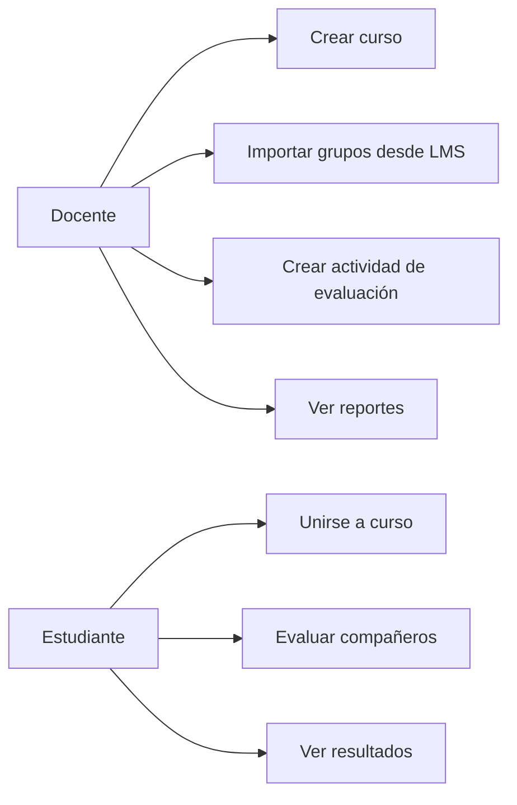
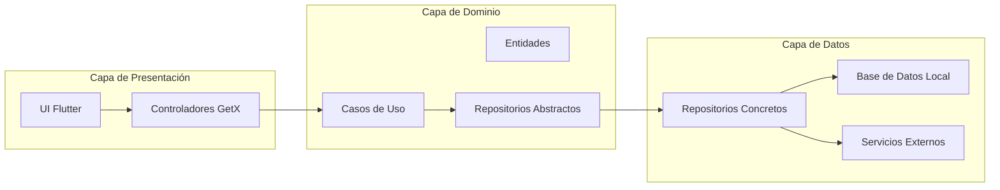
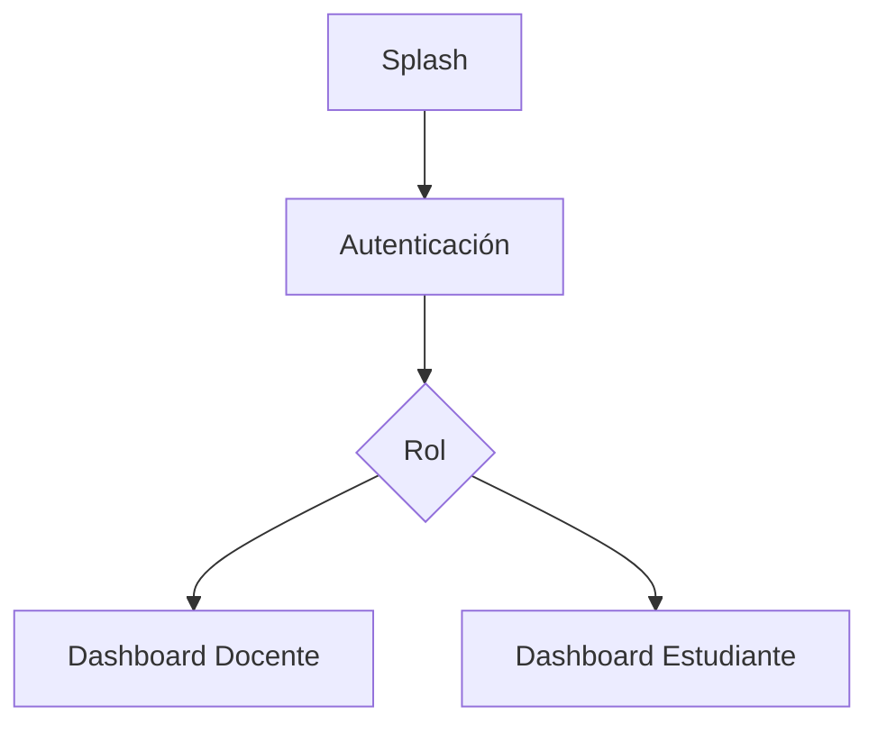
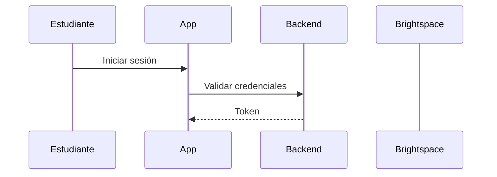

# Aplicación Móvil de Evaluación entre Pares
## Flutter + Clean Architecture + GetX

Proyecto universitario de desarrollo móvil orientado a la evaluación entre pares en trabajos colaborativos, siguiendo principios de arquitectura limpia y buenas prácticas de ingeniería de software.

---

## Tabla de Contenido

1. [Descripción general del proyecto](#1-descripción-general-del-proyecto)
2. [Alcance y objetivos](#2-alcance-y-objetivos)
3. [Contexto actual (AS-IS)](#3-contexto-actual-as-is)
4. [Roles de usuario y casos de uso](#4-roles-de-usuario-y-casos-de-uso)
5. [Referentes y soluciones existentes](#5-referentes-y-soluciones-existentes)
6. [Composición de la solución y arquitectura propuesta](#6-composición-de-la-solución-y-arquitectura-propuesta)
7. [Diagrama de arquitectura](#7-diagrama-de-arquitectura)
8. [Arquitectura de roles y navegación](#8-arquitectura-de-roles-y-navegación)
9. [Diseño de módulos](#9-diseño-de-módulos)
10. [Modelo de datos](#10-modelo-de-datos-conceptual)
11. [Integración con Brightspace](#11-integración-con-brightspace-y-servicios-institucionales)
12. [Tecnologías y requerimientos técnicos](#12-tecnologías-y-requerimientos-técnicos)
13. [Diagramas adicionales](#13-diagramas-adicionales)
14. [Diseño UI (Figma)](#14-diseño-ui-figma)
15. [Estructura del repositorio](#15-estructura-del-repositorio)
16. [Tabla comparativa de soluciones](#16-tabla-comparativa-de-soluciones)
17. [Referencias](#17-referencias)

---

## 1. Descripción general del proyecto

La aplicación es una solución móvil desarrollada en Flutter que permite a estudiantes evaluar el desempeño y compromiso de sus compañeros de equipo en actividades colaborativas de curso, sin autoevaluación y con soporte para diferentes criterios de valoración como puntualidad, contribución, compromiso y actitud.

La herramienta busca ofrecer a los docentes información cuantitativa y cualitativa sobre el funcionamiento de los equipos, facilitando la toma de decisiones académicas y la retroalimentación formativa.

El contexto pedagógico del proyecto se centra en cursos con metodologías de trabajo en grupo, donde la evaluación tradicional del producto final no refleja adecuadamente las contribuciones individuales ni la dinámica interna de los equipos. La aplicación se integra conceptualmente con el LMS Brightspace, aprovechando sus categorías de grupos como fuente de información estructurada acerca de los equipos.

---

## 2. Alcance y objetivos

### 2.1 Objetivo general

Desarrollar una aplicación móvil multiplataforma (Android / iOS) con Flutter que permita la evaluación entre pares de estudiantes en trabajos grupales, ofreciendo a docentes y estudiantes un sistema estructurado, seguro y trazable de evaluación de desempeño dentro de los equipos.

### 2.2 Objetivos específicos

- Registrar cursos, docentes y estudiantes.
- Permitir múltiples cursos por docente y múltiples cursos por estudiante.
- Sincronizar o importar la información de grupos desde Brightspace.
- Mantener la coherencia cuando existan cambios en la conformación de equipos.
- Permitir al docente crear actividades de evaluación entre pares con ventanas de tiempo definidas.
- Configurar visibilidad de resultados (pública o privada).
- Gestionar rúbricas de evaluación con criterios y escalas numéricas.
- Proporcionar reportes agregados por actividad, grupo y estudiante.
- Garantizar una experiencia de usuario clara y consistente para ambos roles.

---

## 3. Contexto actual (AS-IS)

En el estado actual del sistema:

- Los grupos no se crean dentro de la aplicación.
- La conformación de equipos se gestiona en Brightspace mediante categorías de grupo.
- La aplicación importa estos grupos mediante sincronización por API o archivos estructurados.

Supuestos clave:

- Los grupos pueden modificarse durante el semestre.
- La aplicación debe reflejar estos cambios de manera coherente.
- La autenticación y el almacenamiento de datos dependen de servicios institucionales como Roble.
- La aplicación se enfoca exclusivamente en la lógica de evaluación entre pares.

---

## 4. Roles de usuario y casos de uso

### 4.1 Roles principales

**Docente**
- Crear y gestionar cursos.
- Invitar estudiantes mediante mecanismos verificados.
- Importar categorías de grupo desde Brightspace.
- Crear y programar actividades de evaluación.
- Definir criterios, ventanas de tiempo y visibilidad.
- Visualizar reportes agregados y detallados.

**Estudiante**
- Unirse a cursos.
- Visualizar actividades pendientes.
- Evaluar a cada miembro del equipo sin autoevaluación.
- Consultar resultados cuando la visibilidad sea pública.

### 4.2 Casos de uso

---

## 5. Referentes y soluciones existentes

- Peerceptiv: https://peerceptiv.com
- FeedbackFruits (Peer Review): https://feedbackfruits.com
- TEAMMATES: https://teammatesv4.appspot.com
- PeerEval: https://peereval.mit.edu

---

## 6. Composición de la solución y arquitectura propuesta

La solución adopta Clean Architecture con separación estricta de capas y gestión de estado mediante GetX, favoreciendo mantenibilidad, testabilidad y escalabilidad.

---

## 7. Diagrama de arquitectura

---

## 8. Arquitectura de roles y navegación

---

## 9. Diseño de módulos

Incluye autenticación, cursos, grupos, actividades de evaluación, rúbricas y reportes, todos desacoplados y alineados con principios SOLID.

---

## 10. Modelo de datos (conceptual)

User, Course, Group, GroupMember, AssessmentActivity, Evaluation, Criterion, CriterionScore

---

## 11. Integración con Brightspace y servicios institucionales

Integración mediante API REST y autenticación centralizada institucional.

---

## 12. Tecnologías y requerimientos técnicos

Flutter, GetX, REST, SQLite/Hive, Clean Architecture, SOLID.

---

## 13. Diagramas adicionales

---

## 14. Diseño UI (Figma)

https://www.figma.com/XXXXXX

---

## 15. Estructura del repositorio

/lib  
/presentation  
/domain  
/data  
/core  

---

## 16. Tabla comparativa de soluciones

| Plataforma | Evaluación entre pares | Integración LMS | Rúbricas configurables | Código abierto |
|----------|-----------------------|-----------------|------------------------|----------------|
| Peerceptiv | Sí | Parcial | Sí | No |
| FeedbackFruits | Sí | Sí | Sí | No |
| TEAMMATES | Sí | No | Limitado | Sí |
| PeerEval | Sí | No | Sí | Sí |
| **Proyecto propuesto** | **Sí** | **Sí (Brightspace)** | **Sí** | **Sí (académico)** |

---

## 17. Referencias

- Peerceptiv – https://peerceptiv.com
- FeedbackFruits – https://feedbackfruits.com
- TEAMMATES – https://teammatesv4.appspot.com
- PeerEval – https://peereval.mit.edu
- Documentación del curso
