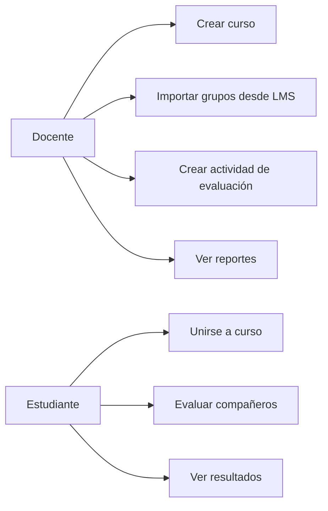
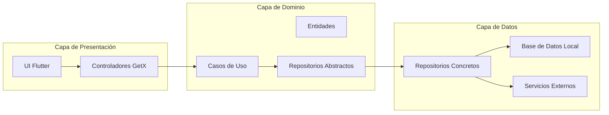
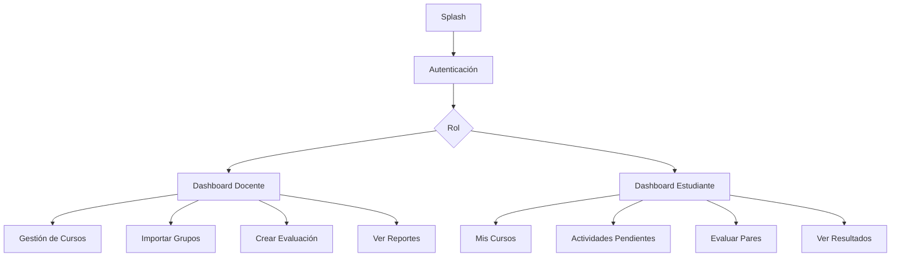
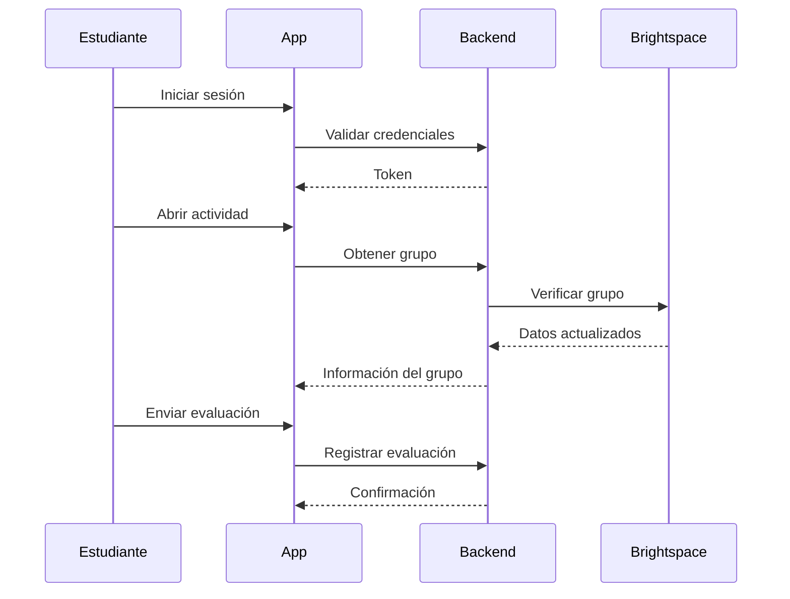

# Aplicación Móvil de Evaluación entre Pares
## Flutter + Clean Architecture + GetX

Proyecto universitario de desarrollo móvil orientado a la evaluación entre pares en trabajos colaborativos, siguiendo principios de arquitectura limpia y buenas prácticas de ingeniería de software.

---

## 1. Descripción general del proyecto

La aplicación es una solución móvil desarrollada en Flutter que permite a estudiantes evaluar el desempeño y compromiso de sus compañeros de equipo en actividades colaborativas de curso, sin autoevaluación y con soporte para diferentes criterios de valoración como puntualidad, contribución, compromiso y actitud.

La herramienta busca ofrecer a los docentes información cuantitativa y cualitativa sobre el funcionamiento de los equipos, facilitando la toma de decisiones académicas y la retroalimentación formativa.

El contexto pedagógico del proyecto se centra en cursos con metodologías de trabajo en grupo, donde la evaluación tradicional del producto final no refleja adecuadamente las contribuciones individuales ni la dinámica interna de los equipos. La aplicación se integra conceptualmente con el LMS Brightspace, aprovechando sus categorías de grupos como fuente de información estructurada acerca de los equipos.

---

## 2. Alcance y objetivos

### 2.1 Objetivo general

Desarrollar una aplicación móvil multiplataforma (Android / iOS) con Flutter que permita la evaluación entre pares de estudiantes en trabajos grupales, ofreciendo a docentes y estudiantes un sistema estructurado, seguro y trazable de evaluación de desempeño dentro de los equipos.

### 2.2 Objetivos específicos

- Registrar cursos, docentes y estudiantes.
- Permitir múltiples cursos por docente y múltiples cursos por estudiante.
- Sincronizar o importar la información de grupos desde Brightspace.
- Mantener la coherencia cuando existan cambios en la conformación de equipos.
- Permitir al docente crear actividades de evaluación entre pares con ventanas de tiempo definidas.
- Configurar visibilidad de resultados (pública o privada).
- Gestionar rúbricas de evaluación con criterios y escalas numéricas.
- Proporcionar reportes agregados por actividad, grupo y estudiante.
- Garantizar una experiencia de usuario clara y consistente para ambos roles.

---

## 3. Contexto actual (AS-IS)

En el estado actual del sistema:

- Los grupos no se crean dentro de la aplicación.
- La conformación de equipos se gestiona en Brightspace mediante categorías de grupo.
- La aplicación importa estos grupos mediante sincronización por API o archivos estructurados.

Supuestos clave:

- Los grupos pueden modificarse durante el semestre.
- La aplicación debe reflejar estos cambios de manera coherente.
- La autenticación y el almacenamiento de datos dependen de servicios institucionales como Roble.
- La aplicación se enfoca exclusivamente en la lógica de evaluación entre pares.

---

## 4. Roles de usuario y casos de uso

### 4.1 Roles principales

**Docente**
- Crear y gestionar cursos.
- Invitar estudiantes mediante mecanismos verificados.
- Importar categorías de grupo desde Brightspace.
- Crear y programar actividades de evaluación.
- Definir criterios, ventanas de tiempo y visibilidad.
- Visualizar reportes agregados y detallados.

**Estudiante**
- Unirse a cursos.
- Visualizar actividades pendientes.
- Evaluar a cada miembro del equipo sin autoevaluación.
- Consultar resultados cuando la visibilidad sea pública.

---

### 4.2 Casos de uso (diagrama compatible con GitHub)



---

## 5. Referentes y soluciones existentes

El diseño del proyecto se inspira en plataformas de evaluación entre pares utilizadas en educación superior, como Peerceptiv, FeedbackFruits (Peer Review), TEAMMATES y PeerEval.

Estos referentes influyen principalmente en:
- El diseño de rúbricas.
- La fiabilidad de la evaluación.
- La automatización de procesos.
- La presentación clara de reportes.

---

## 6. Composición de la solución y arquitectura propuesta

### 6.1 Decisión de arquitectura

Se propone una sola aplicación móvil con gestión de roles diferenciados (docente y estudiante). Esta decisión facilita el mantenimiento del código, el despliegue y la reutilización de componentes.

La arquitectura está diseñada para permitir, en el futuro, la separación en dos aplicaciones independientes con mínimo acoplamiento.

---

### 6.2 Arquitectura general (Clean Architecture + GetX)

La aplicación adopta principios de Clean Architecture, separando responsabilidades en las siguientes capas:

**Capa de Presentación**
- Widgets Flutter.
- Controladores GetX.
- Manejo de estado y navegación.

**Capa de Dominio**
- Entidades.
- Casos de uso.
- Repositorios abstractos.

**Capa de Datos**
- Repositorios concretos.
- DTOs y mapeadores.
- Almacenamiento local.

**Capa de Infraestructura**
- Clientes HTTP.
- Autenticación y tokens.
- Inyección de dependencias.
- Permisos del sistema.

---

## 7. Diagrama de arquitectura



---

## 8. Arquitectura de roles y navegación



---

## 9. Diseño de módulos

### 9.1 Autenticación
- Integración con servicio institucional.
- Manejo seguro de tokens.
- Identificación automática del rol.

### 9.2 Cursos
- Creación y gestión por parte del docente.
- Visualización de cursos del estudiante.
- Asociación con cursos del LMS.

### 9.3 Grupos
- Importación desde Brightspace.
- Sincronización de cambios.
- Asociación con actividades.

### 9.4 Actividades de evaluación
- Nombre de la actividad.
- Ventana de tiempo.
- Visibilidad de resultados.
- Estados: programada, activa, cerrada.

### 9.5 Rúbricas
- Criterios base: puntualidad, contribuciones, compromiso y actitud.
- Escala de 2.0 a 5.0.
- Descriptores claros para cada nivel.
- Diseño extensible.

### 9.6 Reportes
- Reportes por actividad.
- Reportes por grupo.
- Reportes por estudiante.
- Exportación de datos.

---

## 10. Modelo de datos (conceptual)

- User
- Course
- Group
- GroupMember
- AssessmentActivity
- Evaluation
- Criterion
- CriterionScore

---

## 11. Integración con Brightspace y servicios institucionales

- Autenticación centralizada.
- Sincronización periódica de grupos.
- Comunicación mediante API REST o archivos estructurados.
- Uso de backend institucional (Roble).

---

## 12. Tecnologías y requerimientos técnicos

- Flutter
- GetX
- REST / HTTP
- SQLite / Hive
- Clean Architecture
- Principios SOLID

---

## 13. Diagramas adicionales

### 13.1 Secuencia de evaluación entre pares



---

## 14. Diseño UI (Figma)

- Prototipo Docente: https://www.figma.com/XXXXXX_DOCENTE
- Prototipo Estudiante: https://www.figma.com/XXXXXX_ESTUDIANTE

Se recomienda almacenar las imágenes en la carpeta `design/figma/`.

---

## 15. Estructura del repositorio

```
/lib
  /presentation
  /domain
  /data
  /core
/test
/design/figma
/docs
```

---

## 16. Referencias

- Peerceptiv – Peer Assessment
- FeedbackFruits – Peer Review
- TEAMMATES – Student Peer Evaluation
- PeerEval – Peer Assessment App
- Documentación del curso
