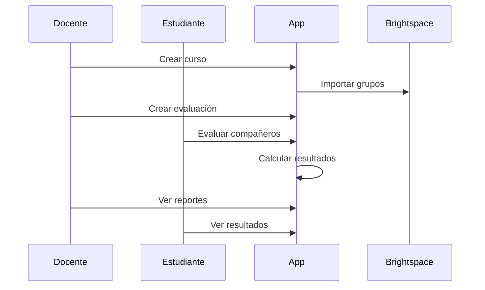

# Aplicación Móvil de Evaluación entre Pares
## Flutter + Clean Architecture + GetX

Proyecto universitario de desarrollo móvil orientado a la evaluación entre pares en trabajos colaborativos, siguiendo principios de arquitectura limpia y buenas prácticas de ingeniería de software.

---

## Tabla de Contenido

1. [Descripción general del proyecto](#1-descripción-general-del-proyecto)
2. [Alcance y objetivos](#2-alcance-y-objetivos)
3. [Contexto actual (AS-IS)](#3-contexto-actual-as-is)
4. [Roles de usuario y casos de uso](#4-roles-de-usuario-y-casos-de-uso)
5. [Referentes y soluciones existentes](#5-referentes-y-soluciones-existentes)
6. [Justificación de la propuesta](#6-justificación-de-la-propuesta)
7. [Composición y diseño de la solución](#7-composición-y-diseño-de-la-solución)
8. [Flujo funcional detallado](#8-flujo-funcional-detallado)
9. [Arquitectura de la solución](#9-arquitectura-de-la-solución)
10. [Diseño de módulos](#10-diseño-de-módulos)
11. [Modelo de datos](#11-modelo-de-datos-conceptual)
12. [Integración con Brightspace](#12-integración-con-brightspace-y-servicios-institucionales)
13. [Tecnologías](#13-tecnologías-y-requerimientos-técnicos)
14. [Prototipo y diseño UI](#14-prototipo-y-diseño-ui)
15. [Tabla comparativa de soluciones](#15-tabla-comparativa-de-soluciones)
16. [Elementos adicionales de soporte](#16-elementos-adicionales-de-soporte)
17. [Referencias](#17-referencias)

---

## 1. Descripción general del proyecto

La aplicación es una solución móvil desarrollada en Flutter que permite a estudiantes evaluar el desempeño y compromiso de sus compañeros de equipo en actividades colaborativas de curso, sin autoevaluación y con soporte para criterios como puntualidad, contribución, compromiso y actitud.

---

## 2. Alcance y objetivos

### Objetivo general
Desarrollar una aplicación móvil multiplataforma que soporte la evaluación entre pares en trabajos grupales, brindando información clara y confiable a docentes y estudiantes.

### Objetivos específicos
- Gestión de cursos, usuarios y roles.
- Importación y sincronización de grupos desde Brightspace.
- Creación de actividades de evaluación con rúbricas configurables.
- Visualización de resultados y reportes agregados.

---

## 3. Contexto actual (AS-IS)

La conformación de grupos y gestión académica se realiza actualmente en Brightspace. La evaluación entre pares se hace de forma manual, dispersa y poco estructurada, dificultando la trazabilidad y el análisis.

---

## 4. Roles de usuario y casos de uso

### Docente
- Crear cursos y actividades.
- Importar grupos.
- Analizar reportes.

### Estudiante
- Unirse a cursos.
- Evaluar a sus compañeros.
- Consultar resultados.

---

## 5. Referentes y soluciones existentes

- Peerceptiv: https://peerceptiv.com  
- FeedbackFruits (Peer Review): https://feedbackfruits.com  
- TEAMMATES: https://teammatesv4.appspot.com  
- PeerEval: https://peereval.mit.edu  

---

## 6. Justificación de la propuesta

A partir del análisis de los referentes, se identifican limitaciones comunes como licenciamiento cerrado, baja integración con LMS específicos y poca flexibilidad en la adaptación institucional.

Entrevistas informales realizadas a docentes universitarios que implementan trabajos colaborativos evidencian necesidades claras:
- Evaluaciones estructuradas y rápidas.
- Eliminación de autoevaluación.
- Reportes claros por estudiante y grupo.
- Integración con plataformas institucionales existentes.

La propuesta responde directamente a estas necesidades con una solución móvil, modular y adaptable.

---

## 7. Composición y diseño de la solución

Se propone **una única aplicación móvil** con gestión de roles (docente y estudiante), lo cual:
- Reduce costos de desarrollo y mantenimiento.
- Garantiza consistencia en la experiencia de usuario.
- Permite escalar a aplicaciones separadas en el futuro si es necesario.

---

## 8. Flujo funcional detallado

1. El docente crea un curso.
2. Se importan grupos desde Brightspace.
3. El docente crea una actividad de evaluación.
4. Los estudiantes acceden durante la ventana activa.
5. Cada estudiante evalúa a sus compañeros (sin autoevaluación).
6. El sistema calcula resultados.
7. El docente visualiza reportes.
8. Los estudiantes ven resultados si la visibilidad es pública.

---

## 9. Arquitectura de la solución

Clean Architecture + GetX, separando presentación, dominio y datos para garantizar mantenibilidad y testabilidad.

---

## 10. Diseño de módulos

- Autenticación
- Cursos
- Grupos
- Evaluaciones
- Rúbricas
- Reportes

---

## 11. Modelo de datos (conceptual)

User, Course, Group, GroupMember, AssessmentActivity, Evaluation, Criterion, CriterionScore

---

## 12. Integración con Brightspace y servicios institucionales

- Autenticación centralizada.
- Sincronización de grupos.
- Comunicación mediante API REST.

---

## 13. Tecnologías y requerimientos técnicos

Flutter, GetX, REST, SQLite/Hive, Clean Architecture, SOLID.

---

## 14. Prototipo y diseño UI

- Prototipo Figma: https://www.figma.com/XXXXXX  
- Capturas de pantalla del prototipo (a integrar):
  - Pantalla de inicio de sesión
  - Dashboard docente
  - Evaluación entre pares
  - Reportes

*(Las capturas deben añadirse como imágenes en el repositorio y referenciarse aquí con Markdown)*

---

## 15. Tabla comparativa de soluciones

| Plataforma | Evaluación entre pares | Integración LMS | Rúbricas | Código abierto |
|-----------|------------------------|----------------|----------|----------------|
| Peerceptiv | Sí | Parcial | Sí | No |
| FeedbackFruits | Sí | Sí | Sí | No |
| TEAMMATES | Sí | No | Limitado | Sí |
| PeerEval | Sí | No | Sí | Sí |
| **Propuesta** | **Sí** | **Sí (Brightspace)** | **Sí** | **Sí (académico)** |

---

## 16. Elementos adicionales de soporte

- Diagramas de arquitectura y secuencia.
- Comparación con soluciones existentes.
- Justificación pedagógica y técnica.
- Preparación para evaluación académica.

---

## 17. Referencias

- Peerceptiv – https://peerceptiv.com  
- FeedbackFruits – https://feedbackfruits.com  
- TEAMMATES – https://teammatesv4.appspot.com  
- PeerEval – https://peereval.mit.edu  
- Documentación del curso
